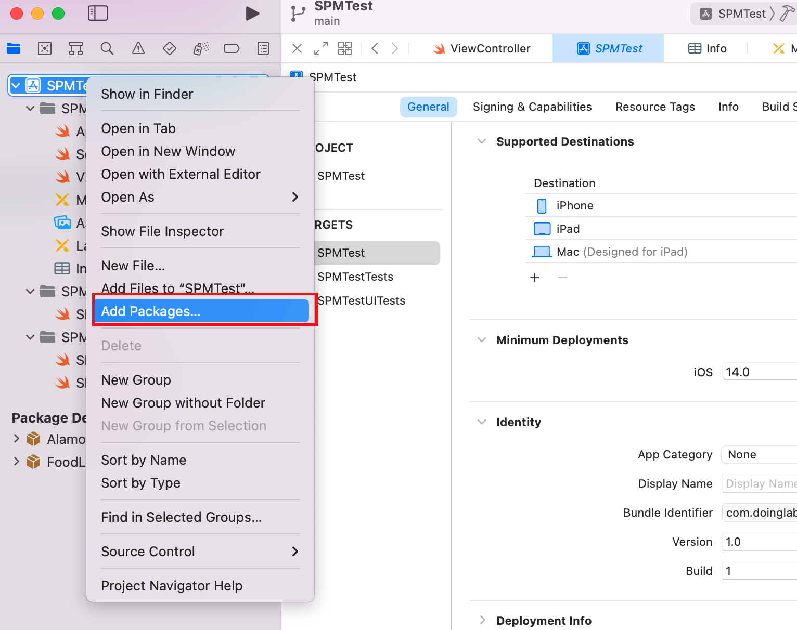

# Manual for iOS FoodLensSDK-V3
## [iOS SDK 한글 설명서 보기](README_KO.md)
## [Go to ReleaseNote](ReleaseNote.md)
This is a combined SDK for Android supporting FoodLens, CaloAI(FoodLens 2.0).  
FoodLens is composed of Core SDK and UI SDK. You may use the functions of FoodLens by using the Core SDK to create your own UI, or you may also use the UI SDK to use the UI screen provided by Doinglab.

## Requirements
* Over iOS Ver 14.0
* Over Swift Version 5.5

## 1. iOS Project Setting

### 1.1 Setting info.plist 
Please add Camera and Galley permission in Info.plist as bellow.
- Privacy - Camera Usage Description
- Privacy - Photo Library Additions Usage Description
- Privacy - Photo Library Usage Description

### 1.2 Install FoodLens SDK
 Use SPM(Swift Package Manager) to install FoodLens Library.
- File > Swift Packages > Add Package Dependency
  
When Using Core SDK Only, please use below address
- https://bitbucket.org/doing-lab/ios_foodlenscoresdk

When Using UI SDK Together, please use below address 
- https://bitbucket.org/doing-lab/ios_foodlensuisdk

<center></center>
<center></center>

### 1.3 Setting AppToken, CompanyToken
Add FoodLensAppToken, FoodLensCompanyToken on inpo.plist
```
<key>FoodLensAppToken</key>
<string>App Token</string>
<key>FoodLensCompanyToken</key>
<string>Company Token</string>
```

## 2. How to Use Core SDK
- FoodLens API is an API that works FoodLens features based on image file.  
- You may use the Core SDK to compose a screen UI through customizing without using the UI provided by Doinglab.

### 2.1 Obtaining Nutritional Information
1. Create FoodLensCoreService instance.
    - You may choose FoodLensType between foodlens and caloai.
2. Call predict method.
   Parameters is UIImage which will be used.   
   ※ FoodLens SDK supports three method like async, Combine, Escaping closure. (Refer to sample code)    
   ※ The recognition qulity may be lowered when the image is small. 

#### Code Example
``` swift
let foodlensCoreService = FoodLensCoreService(type: .foodlens)

guard let image = image else {
    return
}

Task {
    let result = await foodlensCoreService.predict(image: image, userId: self.userId)
    switch result {
    case .success(let response):
        DispatchQueue.main.async {
            // UI Update
        }
    case .failure(let error):
        print(error)
    }
}
```

### 2.2 2.2 FoodlensCoreSDK Option
- Default value will be set when not set.
#### 2.2.1 Language Option  
```
//You may choose between LanguageConfig.device, LanguageConfig.ko(Korean), LanguageConfig.en(English), LanguageConfig.ja(Japanese).
//FoodLens supports ko, en and Caloai supports ko, en, ja.
//Default is device.
foodlensCoreService.setLanguage(.en)
```

#### 2.2.2 API Performance Option
```
//API performance may be changed on demand.
//1. ImageResizingType.speed : Fast processing (1~2 food level)
//2. ImageResizingType.normal : The most common processing (2~4 food level)
//3. ImageResizingType.quality : You may choose between three. (More than 4 foods can be handled at once with highest food recognition rate although the spped is low)
//Default is ImageResizingType.normal.
foodlensCoreService.setImageResizingType(.quality)
```

#### 2.2.3 Nutrition Return Option
```
//This is an option for nutrition returned after recognition.
//1. NutritionRetrievalOption.all : Deliever nutrition about every food candidates
//2. NutritionRetrievalOption.tpo1 : Deliver nutrition only for the most likely food 
//3. NutritionRetrievalOption.no : Deliever only recognition result and not the nutrition
//Default is all.
foodlensCoreService.setNutritionRetrieveOption(.all)
```

### 2.3 Food Information Search
1. Create FoodLensCoreService instance.
    - You may choose FoodLensType between foodlens, caloai.
2. call foodInfo method.
※ SDK supports async, combine, closure three methods. (Refer to sample code)

#### Code Example
```swift
let foodlensCoreService = FoodLensCoreService(type: .foodlens)

Task {
    let result = await foodlensCoreService.foodInfo(foodId: id)
    switch result {
    case .success(let response):
        DispatchQueue.main.async {
            // UI Update
        }
    case .failure(let failure):
        print(failure)
    }
}
```

### 2.4 Food Name Search
1. Create FoodLensCoreService instance.
    - You may choose FoodLensType between foodlens, caloai.
2. CAll searchFoodbyName method.    
※ SDK supports async, combine, closure three methods. (Refer to sample code)

#### Code Example
```swift
let foodlensCoreService = FoodLensCoreService(type: .foodlens)

Task {
    let result = await foodlensCoreService.searchFoodbyName(name)
    switch result {
    case .success(let response):
        DispatchQueue.main.async {
            // UI Update
        }
    case .failure(let failure):
        print(failure)
    }
}
```
 

## 3. How to Use UI SDK
- UI SDK has a feature to develop service using the basic UI provided by FoodLens.  
- UI API includes simple screen Customize feature.

### 공통 모듈 사용
parent에는 FoodLensUI의 View를 띄울 UIViewController를 전달하고, completionHandler에는 결과를 처리할 RecognitionResultHandler를 전달합니다.

### 3.1 UI Service의 인식 기능 사용
1. Crate FoodLensUIService instance.    
You may choose FoodLensType between foodlens and caloai.
2. Call startFoodLensCamera method.
Parameters are Parent ViewController and RecognitionResultHandler.

```swift
class ReconitionHandler : RecognitionResultHandler {
    func onSuccess(_ result: FoodLensCore.RecognitionResult) {
        // Get image which is selected by user
        FoodLensStorage.shared.load(fileName: result.imagePath ?? "")

        //implement code
    }
    
    func onCancel() {
        //implement code
    }
    
    func onError(_ error: Error) {
        //implement code
    }   
}
............

let foodLensUIService = FoodLensUIService(type: .foodlens)
foodLensUIService.startFoodLensCamera(parent: self, completionHandler: ReconitionHandler())
```

### 3.2 Using Gallery Feature
Call startFoodLensGallery를 method.

```swift
foodLensUIService.startFoodLensGallery를(parent: self, completionHandler: ReconitionHandler())
```

### 3.3 Using Search Feature
Call startFoodLensSearch를 method.

```swift
foodLensUIService.startFoodLensSearch를(parent: self, completionHandler: ReconitionHandler())
```


### 3.4 Using Data Revise Feature of UI Service
You can use nutritional information obtained from 3.1, 3.2, 3.3. 
- Deliver recognitionResult when calling startFoodLensDataEdit.
#### *Important* You shall set to save the image to be shown on the screen in device local path and set imagePath of RecognitionResult before calling revise feature.

```swift
// Please use below method to store image file in local storage before call FoodLens
FoodLensStorage.shared.save(image: image, fileName: "local image file name")

let mealData = RecognitionResult.create(json: jsonString)
mealData.imgPath = "local image file name"
foodLensUIService.startFoodLensDataEdit(recognitionResult: mealData, parent: self, completionHandler: ReconitionHandler())
```

#### 3.4.1 Call FoodLensUI based on SwiftUI
FoodLens SDK supports EnvironmentValues to call UIViewController based on  SwiftUI.

```swift
struct ContentView: View {
    @Environment (\.viewController) var viewControllerHolder
    
    var body: some View {
        VStack {
            Button("start") {
                let foodlensUIService = FoodLensUIService(type: .foodlens)
                foodLensUIService.startFoodLensCamera(parent: self.viewControllerHolder, completionHandler: ReconitionHandler())
            }
        }
        .padding()
    }
}
```

#### 3.4.2 RecognitionResultHandler
RecognitionResultHandler 프로토콜에는 세가지 메소드가 정의되어 있습니다.    
- onSuccess(_: RecognitionResult): 성공했을 때 호출되며 결과 값을 처리하는 메소드
- onCancel(): 사용자가 인식을 취소하면 호출되는 메소드
- onError(_: Error): 에러가 발생 했을 때 호출되는 메소드


#### 3.4.3 FoodLensStorage
사용자가 UI에서 선택하여 분석한 이미지를 가져올 수 있고, Data 수정 기능을 사용할 때 이미지를 저장하여 전달할 수 있습니다.

```swift
// 사용자가 선택하여 분석한 사진 가져오기
FoodLensStorage.shared.load(_: String)

// 해당 메소드를 통해 UIImage와 이미지 파일 이름만 전달하여 FoodLens 전용 폴더에 저장
FoodLensStorage.shared.save(_: UIImage, _: String)
```


### 3.5. UI SDK 옵션 및 매인 컬러 변경 (option)

#### 3.5.1 UI 테마 변경
- FoodLens UI 의 매인 색상을 변경할 수 있습니다.  
- FoodLens UI 의 메인 텍스트 색상을 변경할 수 있습니다.
```swift
let uiConfig = FoodLensUIConfig(
    mainColor: .green,                      // 메인 색상
    mainTextColor: . white                  // 메인 텍스트 색상
)

foodLensUIService.setUIConfig(uiConfig) 
```


#### 3.5.2 FoodLens 옵션 변경
```swift
let settingConfig = FoodLensSettingConfig(
    isEnableCameraOrientation: true,        // 카메라 회전 기능 지원 여부 (defalut : true)
    isShowPhotoGalleryIcon: true,           // 카메라 화면에서 갤러리 버튼 활성화 여부 (defalut : true)
    isShowManualInputIcon: true,            // 카메라 화면에서 검색 버튼 활성화 여부 (defalut : true)
    isShowHelpIcon: true,                   // 카메라 화면에서 help 아이콘 활성화 여부 (defalut : true)
    isSaveToGallery: true,                  // 촬영한 이미지 갤러리 저장 여부 (defalut : false)
    isUseEatDatePopup: true,                // 갤러리에서 이미지 불러올 때 촬영 일자 사용여부 (ture일 경우 선택 팝업 표시)
    imageResizingType: .normal              // //이미지 리사이즈 방식 옵션, SPEED(속도우선), NORMAL, QUALITY(결과 품질 우선) (defalut : NORMAL)
    language: .en,                          // 제동되는 음식 정보 언어 설정 (음식정보 외에 UI에 표시되는 텍스트의 언어는 기기에 설정된 언어로 표시) (defalut : device)
    eatDate: Date(),                        // 식시 시간 설정(default: 현재 시간, isUseEatDatePopup == true 시 팝업에서 입력 받은 시간으로 설정)
    eatType: .lunch,                        // 식사 타입 설정(default: 시간에 맞는 식사 타입)
    recommendKcal: 2400,                    // 1일 권장 칼로리 (defalut : 2,000)
)

foodLensUIService.setSettingConfig(settingConfig)
```

#### 3.5.3 식사 타입 자동 설정
사용자가 MealType을 이용하여 식사타입 설정을 직접 하지 않은 경우, 음식 식사 타입은 기준 시간을 기준으로 자동설정됨
```
아침 : 5시 ~ 10시
아침간신 : 10 ~ 11시
점심 : 11시 ~ 13시
점심간신 : 13시 ~ 17시
저녁 : 17시 ~ 20시
야식 : 20시 ~ 5시
```


## 4. JSON 변환

### 4.1 RecognitionResult -> JSON string
RecognitionResultHandler.onSuccess 함수의 파라미터로 전달되는 RecognitionResult 객체를 JSON 문자열로 변환할 수 있습니다. 

```swift
public func onSuccess(_ result: RecognitionResultHandler) {
    let jsonString = result.toJSONString() ?? ""
    print(jsonString)
}
```

### 4.2 JSON string -> RecognitionResult
JSON 문자열을 RecognitionResult 객체로 변환할 경우, 아래처럼 사용하실 수 있습니다.

```swift
let recognitionResult = RecognitionResult.create(json: jsonString)
```


## 5. SDK 상세 스펙  


## 6. SDK 사용 예제 


## 7. JSON Format
[JSON Format](../JSON%20Format)

[JSON Sample](../JSON%20Sample)

## 8. License
FoodLens is available under the MIT license. See the LICENSE file for more info.
