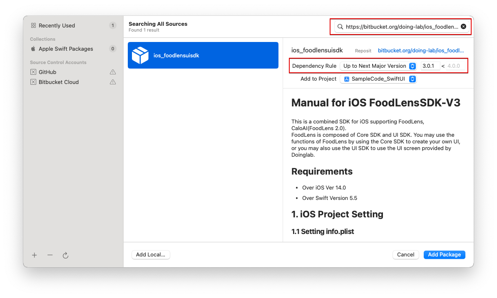

# Manual for iOS FoodLensSDK-V3
## [iOS SDK 한글 설명서 보기](README_KO.md)
## [Go to ReleaseNote](ReleaseNote.md)
This is a combined SDK for iOS supporting FoodLens, CaloAI(FoodLens 2.0).  
FoodLens is composed of Core SDK and UI SDK. You may use the functions of FoodLens by using the Core SDK to create your own UI, or you may also use the UI SDK to use the UI screen provided by Doinglab.

## Requirements
* Over iOS Ver 14.0
* Over Swift Version 5.5

## 1. iOS Project Setting

### 1.1 Setting info.plist 
Please add Camera and Gallery permission in Info.plist as bellow.
- Privacy - Camera Usage Description
- Privacy - Photo Library Additions Usage Description
- Privacy - Photo Library Usage Description

### 1.2 Install FoodLens SDK
Please refer to [ReleaseNote](ReleaseNote.md) to check latest library version. <br>
Use SPM(Swift Package Manager) to install FoodLens Library.
- File > Swift Packages > Add Package Dependency
  
When Using Core SDK only, please use the address below.
- https://bitbucket.org/doing-lab/ios_foodlenscoresdk

When Using UI SDK together, please use the address below. 
- https://bitbucket.org/doing-lab/ios_foodlensuisdk

<center></center>
<center></center>

### 1.3 Setting AppToken, CompanyToken
Add FoodLensAppToken, FoodLensCompanyToken in inpo.plist.
```
<key>FoodLensAppToken</key>
<string>App Token</string>
<key>FoodLensCompanyToken</key>
<string>Company Token</string>
```

### 1.4 FoodLens Standalone Server Address Setting
You can set a server address if you operate a standalone server instead of original FoodLens server. Please discuss with Doinglab for more detailed method.
```
//Add a FoodLensServerAddr entry to info.plist and add a server address
//Add domain names only, no protocols such as http, https, etc e.g.) www.domain.com, 132.213.111.23

<key>FoodLensServerAddr</key>
<string>www.domain.com</string>
```

## 2. How to Use Core SDK
- FoodLens API is an API that works FoodLens features based on image file.  
- You may use the Core SDK to compose a screen UI through customizing without using the UI provided by Doinglab.
- <B> NOTE: BECAUSE OF IMAGE PROCESSING, SDK DO NOT SUPPORT MULTI THREAD ENVIRONMENT. PLEASE DO NOT CALL API CONCURRENTLY. </B>

### 2.1 Obtaining Nutritional Information
1. Create FoodLensCoreService instance.
    - You may choose FoodLensType between <b>foodlens</b> and <b>caloai</b>.
2. Call predict method.
   Parameter is UIImage which will be used.   
   ※ FoodLens SDK supports three method including async, Combine, Escaping closure. (Refer to sample code)    
   ※ The recognition quality may be lowered when the image is small. 

#### Code Example
``` swift
//Please choose foodlens or caloai option
let foodlensCoreService = FoodLensCoreService(type: .foodlens)

guard let image = image else {
    return
}

Task {
    let result = await foodlensCoreService.predict(image: image, userId: self.userId)
    switch result {
    case .success(let response):
        DispatchQueue.main.async {
            // UI Update
        }
    case .failure(let error):
        print(error)
    }
}
```

### 2.2 FoodlensCoreSDK Option
- Default value will be set when not set.
#### 2.2.1 Language Option  
```
//You may choose between LanguageConfig.device, LanguageConfig.ko(Korean), LanguageConfig.en(English), LanguageConfig.ja(Japanese).
//FoodLens supports KO, EN and CaloAI supports KO, EN, JA.
//Default is device.
foodlensCoreService.setLanguage(.en)
```

#### 2.2.2 API Performance Option
```
//API performance may be changed on demand.
//1. ImageResizingType.speed : Fast processing (Can handles 2-3 foods without problems)
//2. ImageResizingType.normal : The most common processing (Can handles 4-6 foods without problems)
//3. ImageResizingType.quality : Best qulity processing. (Can handles several foods without problems although the spped is low)
//Default is ImageResizingType.normal.
foodlensCoreService.setImageResizingType(.quality)
```

#### 2.2.3 Nutrition Return Option
```
//This is an option for nutrition returned after recognition.
//1. NutritionRetrievalOption.all : Deliever nutrition about every food candidates
//2. NutritionRetrievalOption.tpo1 : Deliver nutrition only for the most likely food 
//3. NutritionRetrievalOption.no : Deliever only recognition result and not the nutrition
//Default is all.
foodlensCoreService.setNutritionRetrieveOption(.all)
```

### 2.3 Food Information Search
1. Create FoodLensCoreService instance.
    - You may choose FoodLensType between foodlens, caloai.
2. Call foodInfo method.
※ SDK supports async, combine, closure three methods. (Refer to sample code)

#### Code Example
```swift
let foodlensCoreService = FoodLensCoreService(type: .foodlens)

Task {
    let result = await foodlensCoreService.foodInfo(foodId: id)
    switch result {
    case .success(let response):
        DispatchQueue.main.async {
            // UI Update
        }
    case .failure(let failure):
        print(failure)
    }
}
```

### 2.4 Food Name Search
1. Create FoodLensCoreService instance.
    - You may choose FoodLensType between foodlens, caloai.
2. Call searchFoodbyName method.    
※ SDK supports async, combine, closure three methods. (Refer to sample code)

#### Code Example
```swift
let foodlensCoreService = FoodLensCoreService(type: .foodlens)

Task {
    let result = await foodlensCoreService.searchFoodbyName(name)
    switch result {
    case .success(let response):
        DispatchQueue.main.async {
            // UI Update
        }
    case .failure(let failure):
        print(failure)
    }
}
```
 

## 3. How to Use UI SDK
- UI SDK has a feature to develop service using the basic UI provided by FoodLens.  
- UI API includes simple screen Customize feature.

### 3.1 Using UI Service Recognition Feature
1. Crate FoodLensUIService instance.    
You may choose FoodLensType between foodlens and caloai.
2. Call startFoodLensCamera method.
Parameters are Parent ViewController and RecognitionResultHandler.

```swift
class ReconitionHandler : RecognitionResultHandler {
    func onSuccess(_ result: FoodLensCore.RecognitionResult) {
        // Get image which is selected by user
        let image = FoodLensStorage.shared.load(fileName: result.imagePath ?? "")

        //implement code
    }
    
    func onCancel() {
        //implement code
    }
    
    func onError(_ error: Error) {
        //implement code
    }   
}
............

let foodLensUIService = FoodLensUIService(type: .foodlens)
foodLensUIService.startFoodLensCamera(parent: self, completionHandler: ReconitionHandler())
```

### 3.2 Using Gallery Feature
Call startFoodLensGallery method.

```swift
foodLensUIService.startFoodLensGallery(parent: self, completionHandler: ReconitionHandler())
```

### 3.3 Using Search Feature
Call startFoodLensSearch method.

```swift
foodLensUIService.startFoodLensSearch(parent: self, completionHandler: ReconitionHandler())
```


### 3.4 Using Data Revise Feature of UI Service
You can use nutritional information obtained from 3.1, 3.2, 3.3. 
- Deliver recognitionResult when calling startFoodLensDataEdit.
#### *Important* You shall set to save the image to be shown on the screen in device local path and set imagePath of RecognitionResult before calling revise feature.

```swift
// Please use the method below to store image file in local storage before call FoodLens.
let localFileName = "your_file_name.jpg"
FoodLensStorage.shared.save(image: image, fileName: localFileName)

let mealData = RecognitionResult.create(json: jsonString)
mealData.imgPath = localFileName
foodLensUIService.startFoodLensDataEdit(recognitionResult: mealData, parent: self, completionHandler: ReconitionHandler())
```

#### 3.4.1 Call FoodLensUI based on SwiftUI
FoodLens SDK supports EnvironmentValues to call UIViewController based on  SwiftUI.

```swift
struct ContentView: View {
    @Environment (\.viewController) var viewControllerHolder
    
    var body: some View {
        VStack {
            Button("start") {
                let foodlensUIService = FoodLensUIService(type: .foodlens)
                foodlensUIService.startFoodLensCamera(parent: self.viewControllerHolder, completionHandler: ReconitionHandler())
            }
        }
        .padding()
    }
}
```

#### 3.4.2 RecognitionResultHandler
RecognitionResultHandler protocol defines below mehtod.    
- onSuccess(_: RecognitionResult): It will call when operation is success.
- onCancel(): It will call, user close the UI without meal recording.
- onError(_: Error): It will call when error is occurred.


#### 3.4.3 FoodLensStorage
This is utility function to store/load image before/after using FoodLens.

```swift
//Get image which is recorded by user.
//Parameter is image path. Return type is UIImage which is recorded by user.
FoodLensStorage.shared.load(_: String) -> UIImage

//Save image to local storeage before using Foodlens.
//Parameter is UIImage and file name. You should pass same file name to imgPath on RecognitionResult.
FoodLensStorage.shared.save(_: UIImage, _: String)
```


### 3.5.UI SDK Option and Main Color Change (option)
- Default value will be set when not set.
- 
#### 3.5.1 UI Theme Change
- You may change the main color of FoodLens UI.  
- You may change the main text color of FoodLens UI.
```swift
let uiConfig = FoodLensUIConfig(
    mainColor: .green,                      // Main Color
    mainTextColor: . white                  // Main Text Color
)

foodLensUIService.setUIConfig(uiConfig) 
```


#### 3.5.2 FoodLens Option Change
```swift
let settingConfig = FoodLensSettingConfig(
    isEnableCameraOrientation: true,        // Camera rotation feature support (defalut : true)
    isShowPhotoGalleryIcon: true,           // Gallery icon activation (defalut : true)
    isShowManualInputIcon: true,            // Search input icon activation (defalut : true)
    isShowHelpIcon: true,                   // Help icon activation (defalut : true)
    isSaveToGallery: true,                  // Camera shot save to gellery (defalut : false)
    isUseEatDatePopup: true,                // Save the input time as the time saved in gallery (defalut : true)
    imageResizingType: .normal,             // Image resize method option, SPEED(Speed priority), NORMAL, QUALITY(Result quality priority) (defalut : NORMAL)
    language: .en,                          // Result language setting device, ko, en, ja (defalut : device) (This is only affect to food recognition result. UI language is following system setting.) 
    eatDate: Date(),                        // Meal time setting (default: Current time, isUseEatDatePopup == true Set as input time at pop-u)
    eatType: .lunch,                        // Meal type setting (default: Meal type based on time)
    recommendKcal: 2400,                    // Recommended calorie per day (defalut : 2,000)
    nutrientSummaryDisplayOption: .hidden,  // Nutrient display option on the Summary screen - hidden (do not show), percentage (show as %), weight (show as weight)
    isGenerateCaloAiCandidate: false,       // Whether to include candidates in the API response when using CaloAI
    isEnableNutritionFactsScan: Bool,      	// Enables the Nutrition Facts label scanning feature (default: false)
    isShowMealMemo: Bool                    // Enables the DietNotes feature (default: true)
)

foodLensUIService.setSettingConfig(settingConfig)
```

<b>\*\*nutrientSummaryDisplayOption\*\*

| HIDDEN | PERCENTAGE | WEIGHT |
| ------ | ---------- | ------ |
|  |  |  |

#### 3.5.3 Auto Meal Type Setting
When the user does not set the meal type using MealType, the meal type is automatically set based on the criteria.
```
Breakfast : 5AM ~ 10AM
Morning Snack : 10AM ~ 11AM
Lunch : 11AM ~ 13PM
Afternoon Snack : 13PM ~ 17PM
Dinner : 17PM ~ 20PM
Night Snack : 20PM ~ 5AM
```


## 4. JSON Change

### 4.1 RecognitionResult -> JSON string
You can convert to RecognitionResult to JSON string. 

```swift
public func onSuccess(_ result: RecognitionResultHandler) {
    let jsonString = result.toJSONString() ?? ""
    print(jsonString)
}
```
Please refer JSON format here [JSON Format](../JSON%20Format) 

If some nutrient is not exist, -1 will be returned.

### 4.2 JSON string -> RecognitionResult
You can conver to JSON string to RecognitionResult object.

```swift
let recognitionResult = RecognitionResult.create(json: jsonString)
```

## 5. Error Code
### 401: UNAUTHORIZED
 - CompanyToken is empty or wrong.
 - AppToken is empty or wrong.
### 402: PAYMENT REQUIRED
 - API call limit is over or payment is needed.
### 403: FORBIDDEN
 - Use unauthorized function.
### 404: NOT FOUND
 - No existing URL or not supported URL.
### 406: NOT ACCEPTABLE
 - Package name is empty or wrong.
### 5xx: SERVER ERROR
 - Unexpected server error.

## 6. SDK Specific Spec 


## 7. SDK Use Cases


## 8. JSON Format
[JSON Format](../JSON%20Format)

[JSON Sample](../JSON%20Sample)

## 8. License
FoodLens is available under the MIT license. See the LICENSE file for more info.
