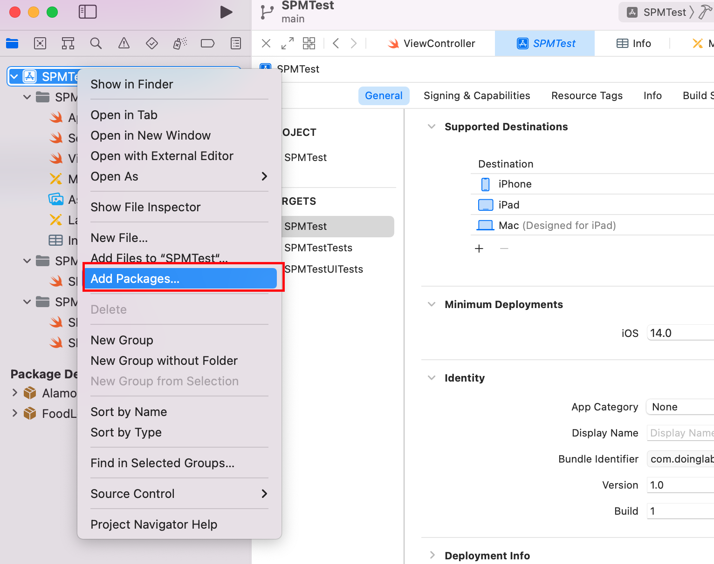
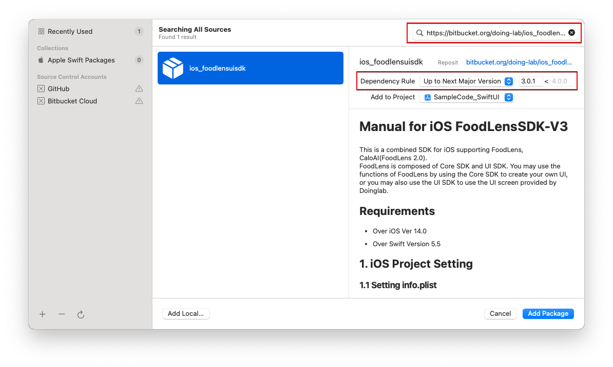

# iOS FoodLensSDK-V3 매뉴얼
## [ReleaseNote 바로가기](ReleaseNote.md)
FoodLens, CaloAI(FoodLens 2.0)을 지원하는 통합 iOS용 SDK입니다.     
FoodLens SDK는 Core SDK와 UI SDK로 이루어 지며, 자체 UI를 작성할 경우는 Core SDK를, Doinglab에서 제공하는 UI화면까지 사용할 경우는 UI SDK를 사용하셔서 FoodLens의 기능을 이용하실 수 있습니다.


## Requirements
* iOS Ver 14.0 이상
* Swift Version 5.5 이상


## 1. iOS 프로젝트 설정

### 1.1 info.plist 설정
아래와 같이 카메라와 갤러리 권한 항목 Info.plist에 추가
- Privacy - Camera Usage Description
- Privacy - Photo Library Additions Usage Description
- Privacy - Photo Library Usage Description

### 1.2 FoodLens SDK 설치 
최종 라이브러리 버전은 [ReleaseNote](ReleaseNote.md)를 확인해 주세요 <br>
SPM(Swift Package Manager)을 이용하여 라이브러리 설치
- File > Swift Packages > Add Package Dependency
  
Core SDK만 사용하는 경우 아래 경로 사용
- https://bitbucket.org/doing-lab/ios_foodlenscoresdk

UI SDK도 사용하는 경우 아래 경로 사용
- https://bitbucket.org/doing-lab/ios_foodlensuisdk

<center></center>
<center></center>

### 1.3 AppToken, CompanyToken 설정
inpo.plist에 FoodLensAppToken, FoodLensCompanyToken 항목 추가하여 AppToken, CompanyToken 입력
```
<key>FoodLensAppToken</key>
<string>App Token</string>
<key>FoodLensCompanyToken</key>
<string>Company Token</string>
```

### 1.4 독립 FoodLens 서버 주소 설정
기본 FoodLens 서버가 아닌 독립 서버를 운용할 경우 서버 주소를 설정 할 수 있습니다.
```
//info.plist에 FoodLensServerAddr 항목을 추가하고 서버 주소를 추가
//도메인 이름만 추가 http, https등 프로토콜은 추가하지 않음 e.g.) www.domain.com, 132.213.111.23 등

<key>FoodLensServerAddr</key>
<string>www.domain.com</string>
```

## 2. Core SDK 사용법
- FoodLens API는 FoodLens 기능을 이미지 파일 기반으로 동작하게 하는 기능입니다.   
- 두잉랩 UI를 사용하지 않고 고객사에서 직접 커스터마이즈 하여 화면을 구성하고자 할 때 Core SDK를 사용할 수 있습니다.
- <B>주의 : 이미지 처리로 인하여 Multi-Thread환경을 지원하지 않습니다. 동시에 여러 API를 호출 하지 마십시오.</b>
  

### 2.1 음식 결과 영양정보 얻기
1. FoodLensCoreService 생성합니다.
    - FoodLensType은 foodlens, caloai 중 선택 할 수 있습니다.
2. predict 메소드를 호출합니다.
   파라미터로 UIImage로 로드된 이미지를 전달합니다.   
   ※ async, Combine, Escaping closure 3가지 방법을 지원합니다. (샘플코드 참고)    
   ※ 이미지가 작은경우 인식율이 낮아질 수 있습니다.

#### 코드 예제
``` swift
let foodlensCoreService = FoodLensCoreService(type: .foodlens)

guard let image = image else {
    return
}

Task {
    let result = await foodlensCoreService.predict(image: image, userId: self.userId)
    switch result {
    case .success(let response):
        DispatchQueue.main.async {
            // UI Update
        }
    case .failure(let error):
        print(error)
    }
}
```

### 2.2 FoodLensCoreSDK 옵션
- 설정하지 않은 경우 기본값으로 설정됩니다.
#### 2.2.1 언어 설정  
```
//LanguageConfig.device, LanguageConfig.ko(한국어), LanguageConfig.en(영어), LanguageConfig.ja(일본어) 4개 중에 선택할 수 있습니다.
//FoodLens는 ko, en을 Caloai의 경우 ko, en, ja를 지원합니다.
//Default는 device 입니다.
foodlensCoreService.setLanguage(.en)
```

#### 2.2.2 API Performance 옵션
```
//요구사항에 따라 API성능을 변경할 수 잇습니다.
//1. ImageResizingType.speed : 빠른 속도의 처리가 필요한 경우 (음식 1~2개 수준)
//2. ImageResizingType.normal, 가장 보편적인 사황처리 (음식수 2~4개 수준)
//3. ImageResizingType.quality 3개 중에 선택할 수 있습니다. (속도가 느리더라도 음식인식율을 최대로 올릴 경우 4개 이상의 음식을 동시에 처리)
//Default는 ImageResizingType.normal 입니다.
foodlensCoreService.setImageResizingType(.quality)
```

#### 2.2.3 영양소 반환 옵션
```
//인식 후 전달받는 영양소에 대한 옵션 입니다.
//1. NutritionRetrievalOption.all : 모둔 음식 후보군 (Candidates food)에 영양소를 전달 받음
//2. NutritionRetrievalOption.tpo1 : 가장 확률이 높은 임식에 대해서만 영양소를 전달 받음 
//3. NutritionRetrievalOption.no : 인식결과만 전달받고 영양소는 전달 받지 않음
//Default는 all 입니다.
foodlensCoreService.setNutritionRetrieveOption(.all)
```

### 2.3 음식정보 검색하기
1. FoodLensCoreService 생성합니다.
    - FoodLensType은 foodlens, caloai 중 선택 할 수 있습니다.
2. foodInfo 메소드를 호출합니다.
※ async, combine, closure 3가지 방법을 지원합니다. (샘플코드 참고)

#### 코드 예제
```swift
let foodlensCoreService = FoodLensCoreService(type: .foodlens)

Task {
    let result = await foodlensCoreService.foodInfo(foodId: id)
    switch result {
    case .success(let response):
        DispatchQueue.main.async {
            // UI Update
        }
    case .failure(let failure):
        print(failure)
    }
}
```

### 2.4 음식이름 검색하기
1. FoodLensCoreService 생성합니다.
    - FoodLensType은 foodlens, caloai 중 선택 할 수 있습니다.
2. searchFoodbyName 메소드를 호출합니다.    
※ async, combine, closure 3가지 방법을 지원합니다. (샘플코드 참고)

#### 코드 예제
```swift
let foodlensCoreService = FoodLensCoreService(type: .foodlens)

Task {
    let result = await foodlensCoreService.searchFoodbyName(name)
    switch result {
    case .success(let response):
        DispatchQueue.main.async {
            // UI Update
        }
    case .failure(let failure):
        print(failure)
    }
}
```
 

## 3. UI SDK 사용법
- UI SDK는 FoodLens 에서 제공하는 기본 UI를 활용하여 서비스를 개발 할 수 있는 기능입니다.  
- UI API는 간단한 화면 Customize기능을 포함하고 있습니다.

### 공통 모듈 사용
parent에는 FoodLensUI의 View를 띄울 UIViewController를 전달하고, completionHandler에는 결과를 처리할 RecognitionResultHandler를 전달합니다.

### 3.1 UI Service의 인식 기능 사용
1. FoodLensUIService 인스턴스 생성합니다.    
FoodLensType은 foodlens, caloai 중 선택 할 수 있습니다.
2. startFoodLensCamera 메소드를 호출합니다.
파라미터는 Parent ViewController와 RecognitionResultHandler 입니다.

```swift
class ReconitionHandler : RecognitionResultHandler {
    func onSuccess(_ result: FoodLensCore.PredictResult) {
        // 사용자가 선택하여 분석한 사진 가져오기
        FoodLensStorage.shared.load(fileName: result.imagePath ?? "")

        //implement code
    }
    
    func onCancel() {
        //implement code
    }
    
    func onError(_ error: Error) {
        //implement code
    }   
}
............

let foodlensUIService = FoodLensUIService(type: .foodlens)
foodlensUIService.startFoodLensCamera(parent: self, completionHandler: ReconitionHandler())
```

### 3.2 갤러리 기능 사용
startFoodLensGallery를 메소드를 호출 합니다.

```swift
foodlensUIService.startFoodLensGallery를(parent: self, completionHandler: ReconitionHandler())
```

### 3.3 검색 기능 사용
startFoodLensSearch를 메소드를 호출 합니다.

```swift
foodlensUIService.startFoodLensSearch를(parent: self, completionHandler: ReconitionHandler())
```


### 3.4 Data 수정 기능 사용
- 3.1, 3.2, 3.3 에서 획득한 영양정보를 다시 활용 할 수 있습니다.
- 작성한 recongitionResult를 startFoodLensDataEdit 호출시 전달합니다.
#### *중요* 수정 기능을 호출하기 이전에 화면에 표시할 이미지를 디바이스 로컬에 저장하고 RecognitionResult의 imagePath에 설정 해야 합니다. 

```swift
// 해당 메소드를 통해 UIImage와 이미지 파일 이름만 전달하여 FoodLens 전용 폴더에 저장
FoodLensStorage.shared.save(image: image, fileName: "local image file name")

let mealData = RecognitionResult.create(json: jsonString)
mealData.imgPath = "local image file name"
foodLensUIService.startFoodLensDataEdit(recognitionResult: mealData, parent: self, completionHandler: ReconitionHandler())
```

#### 3.4.1 SwiftUI에서 FoodLensUI 띄우기
SwiftUI에서 UIViewController로 뷰를 띄우기 위해 EnvironmentValues를 제공합니다.

```swift
struct ContentView: View {
    @Environment (\.viewController) var viewControllerHolder
    
    var body: some View {
        VStack {
            Button("start") {
                let foodlensUIService = FoodLensUIService(type: .foodlens)
                foodlensUIService.startFoodLensCamera(parent: self.viewControllerHolder, completionHandler: CallBackObject())
            }
        }
        .padding()
    }
}
```

#### 3.4.2 RecognitionResultHandler
RecognitionResultHandler 프로토콜에는 세가지 메소드가 정의되어 있습니다.    
- onSuccess(_: RecognitionResult): 성공했을 때 호출되며 결과 값을 처리하는 메소드
- onCancel(): 사용자가 인식을 취소하면 호출되는 메소드
- onError(_: Error): 에러가 발생 했을 때 호출되는 메소드

#### 3.4.3 FoodLensStorage
사용자가 UI에서 선택하여 분석한 이미지를 가져올 수 있고, Data 수정 기능을 사용할 때 이미지를 저장하여 전달할 수 있습니다.

```swift
// 사용자가 선택하여 분석한 사진 가져오기
FoodLensStorage.shared.load(_: String)

// 해당 메소드를 통해 UIImage와 이미지 파일 이름만 전달하여 FoodLens 전용 폴더에 저장
FoodLensStorage.shared.save(_: UIImage, _: String)
```

### 3.5. UI SDK 옵션 및 매인 컬러 변경 (option)

#### 3.5.1 UI 테마 변경
- FoodLens UI 의 매인 색상을 변경할 수 있습니다.  
- FoodLens UI 의 메인 텍스트 색상을 변경할 수 있습니다.
```swift
let uiConfig = FoodLensUIConfig(
    mainColor: .green,                      // 메인 색상
    mainTextColor: . white                  // 메인 텍스트 색상
)

foodlensUIService.setUIConfig(uiConfig) 
```


#### 3.5.2 FoodLens 옵션 변경
```swift
let settingConfig = FoodLensSettingConfig(
    isEnableCameraOrientation: true,        // 카메라 회전 기능 지원 여부 (defalut : true)
    isShowPhotoGalleryIcon: true,           // 카메라 화면에서 갤러리 버튼 활성화 여부 (defalut : true)
    isShowManualInputIcon: true,            // 카메라 화면에서 검색 버튼 활성화 여부 (defalut : true)
    isShowHelpIcon: true,                   // 카메라 화면에서 help 아이콘 활성화 여부 (defalut : true)
    isSaveToGallery: true,                  // 촬영한 이미지 갤러리 저장 여부 (defalut : false)
    isUseEatDatePopup: true,                // 갤러리에서 이미지 불러올 때 촬영 일자 사용여부 (ture일 경우 선택 팝업 표시)
    imageResizingType: .normal              // //이미지 리사이즈 방식 옵션, SPEED(속도우선), NORMAL, QUALITY(결과 품질 우선) (defalut : NORMAL)
    language: .en,                          // 제동되는 음식 정보 언어 설정 (음식정보 외에 UI에 표시되는 텍스트의 언어는 기기에 설정된 언어로 표시) (defalut : device)
    eatDate: Date(),                        // 식시 시간 설정(default: 현재 시간, isUseEatDatePopup == true 시 팝업에서 입력 받은 시간으로 설정)
    eatType: .lunch,                        // 식사 타입 설정(default: 시간에 맞는 식사 타입)
    recommendKcal: 2400,                    // 1일 권장 칼로리 (defalut : 2,000)
    isEnableThousandSeparator: false  	    // 천 단위 콤마 사용 여부 (default : false)
    nutrientSummaryDisplayOption: .hidden   // Summary 화면 영양소 표시 옵션 - hidden(표시하지 않음), percentage(퍼센트 표시), weight(중량 표시) (default : hidden)
    isGenerateCaloAiCandidate: false        // CaloAI를 사용할 때 API 응답 시 candidates 포함 여부 (default: false)
)

foodlensUIService.setSettingConfig(settingConfig)
```

<b>\*\*nutrientSummaryDisplayOption\*\*

| HIDDEN | PERCENTAGE | WEIGHT |
| ------ | ---------- | ------ |
|  |  |  |

#### 3.5.3 식사 타입 자동 설정
사용자가 MealType을 이용하여 식사타입 설정을 직접 하지 않은 경우, 음식 식사 타입은 기준 시간을 기준으로 자동설정됨
```
아침 : 5시 ~ 10시
아침간신 : 10 ~ 11시
점심 : 11시 ~ 13시
점심간신 : 13시 ~ 17시
저녁 : 17시 ~ 20시
야식 : 20시 ~ 5시
```


## 4. JSON 변환

### 4.1 RecognitionResult -> JSON string
RecognitionResultHandler.onSuccess 함수의 파라미터로 전달되는 RecognitionResult 객체를 JSON 문자열로 변환할 수 있습니다. 

```swift
public func onSuccess(_ result: RecognitionResultHandler) {
    let jsonString = result.toJSONString() ?? ""
    print(jsonString)
}
```

### 4.2 JSON string -> RecognitionResult
JSON 문자열을 RecognitionResult 객체로 변환할 경우, 아래처럼 사용하실 수 있습니다.

```swift
let recognitionResult = RecognitionResult.create(json: jsonString)
```

## 5. Error Code
### 401: UNAUTHORIZED
   - CompanyToken 혹은 AppToken 이 잘못되었거나 빈값인 경우
### 402: PAYMENT REQUIRED
   - API 호출 횟수가 계약횟수를 초과한 경우 혹은 비용 결제가 안된경우
### 403: FORBIDDEN
   - 사용할 수 없는 기능
### 404: NOT FOUND
  - 지원하지 않는 URL
### 406: NOT ACCEPTABLE
  - 등록한 패키지명과 API를 호출한 서비스의 패키지명이 다른 경우
### 5xx: SERVER ERROR
 - 서버에러

## 6. SDK 상세 스펙  


## 7. SDK 사용 예제 


## 8. JSON Format
[JSON Format](../JSON%20Format)

[JSON Sample](../JSON%20Sample)

## 8. License
FoodLens is available under the MIT license. See the LICENSE file for more info.
