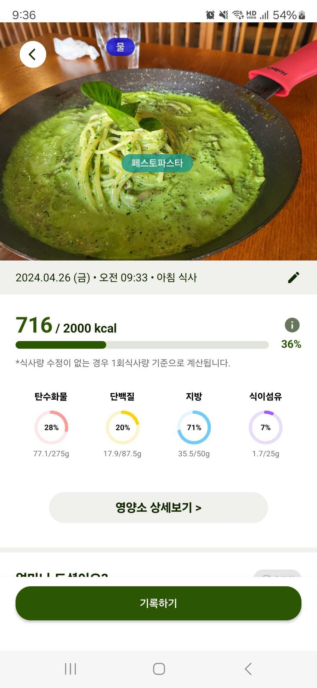
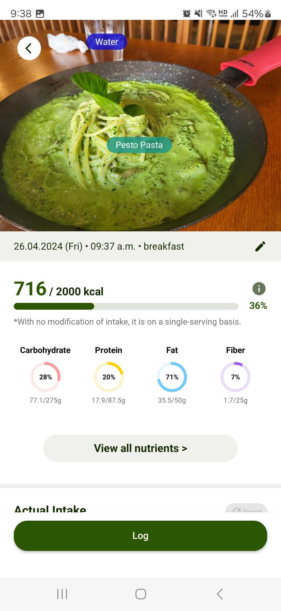
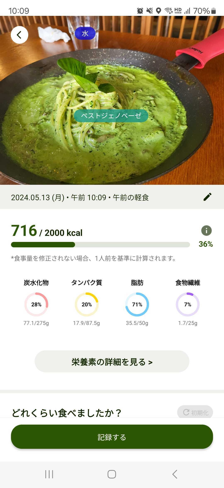

# FoodLensSDK-V3

This is a combined SDK for supporting FoodLens, CaloAI(FoodLens 2.0).
- Android SDK  
  [Manual for Android SDK](Android/)

- iOS SDK  
  [Manual for iOS SDK](IOS/)

- FoodLensCoreSDK supports Korean, English and also Japanese.
- FoodLensUISDK supports Korean and English UI. 
  (In case of food recognition result, SDK can support Korean, English, Japanese.)
  
  

